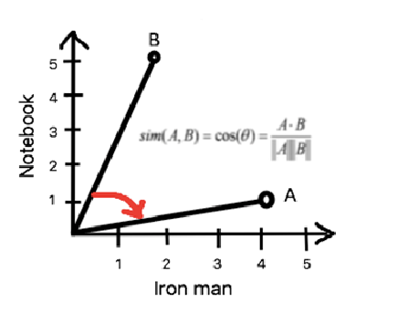
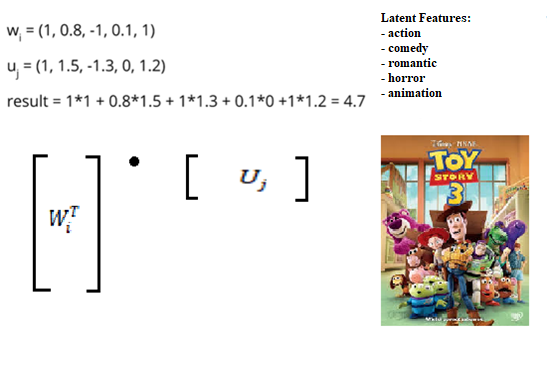

# About Recommender System
This is a demo of a system that i want to expand in the future. The system uses a simple PostgreSQL data base just to save somewhere user rates and then based off them recommend movies using one of four algorithms.
The login system is not developed yet, so anyone can log in with an username but with no password provided. Then that username is stored in database, so when they log in again, they have theirs rates already stored.

The system comes with 4 different algorithms to recommend movies.
	* Item-based Neighborhood
	* User-based Neighborhood
	* Matrix Factorization
	* Matric Factorization (vectorized)

You can choose the method from the nav-bar on top. 
Matrix Factorization is a lot faster than the other algorithms, because it is already trained, and the users and movies vectors are just loaded in from a file. The neighborhood methods must go through the whole set and calculate all of the weights for either users or movies. 

## How does Neighborhood-based methods work?
### Pearson Corelation
Pearson Corelation plays the main role in Neighborhood-based algorithms.  
It uses Pearson equation to find weights between either users or movies.

### A simple graphic shows how corelation between different movies are calculeted:

## Matrix Factorization
Matrix factorization algorithms work by decomposing the user-item interaction matrix into the product of two lower dimensionality rectangular matrices. 
Let's say we have our rating matrix R which is sparse (has missing values). Matrix Factorization decomposes it into two factors (hence the name) W (of size n x k) and U (of size m x k), where:
* n - the amount of users in our dataset
* m - the amount of movies in our dataset
* k - latent features

### What are latent features?
It's the most important thing about MF. Latent features are 'hidden' features that a movie can have(for example the level of action a movie has, the level of crime etc.) They are computed by matrix factorization, it find them itself using only ratings from users! How magical!
Let this graphic explain in some level the complexity of MF:

It was explained very briefly :)
If you want to know more about the topic, i wrote my graduation thesis about recommender systems, just hit me up!

### Functionality
* searching though movie's database and rating them
* recommending movies from a set of 4 different recommendation methods
* adding (or deleting) chosen items to 'My list' (just like on Netflix)
* movie's ranking
* title's autocomplete
* going through already rated items

## Requirements
* flask
* numpy
* pandas
* pickle
* sklearn
* And remember to download [data](https://drive.google.com/drive/folders/1CKiwOkzwr-PkInf9R0HlK1o-ivo4YVb-?usp=sharing) for our algorithms and extract all of them in data folder.

